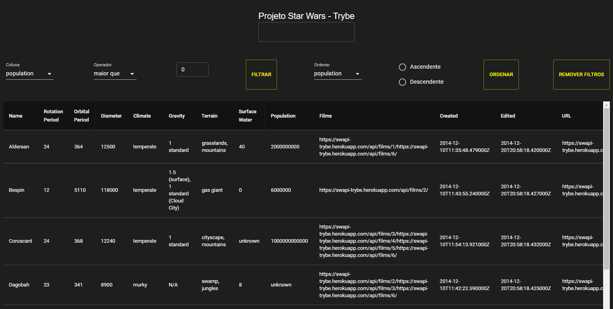
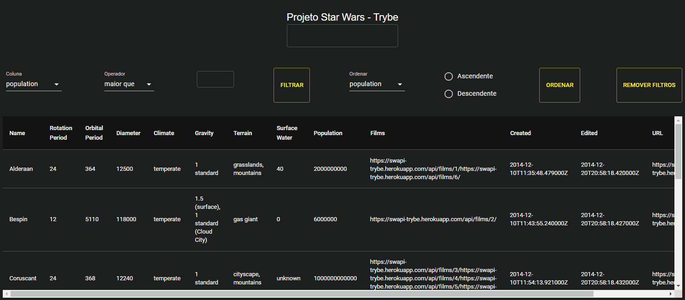
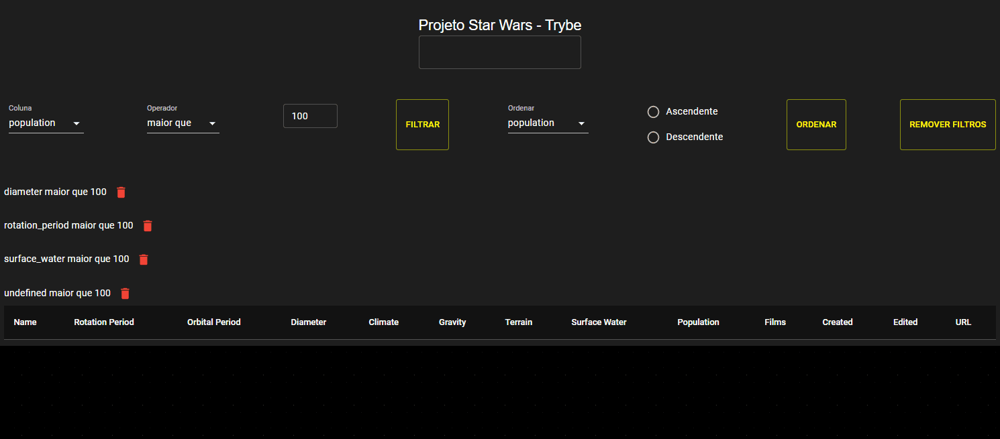
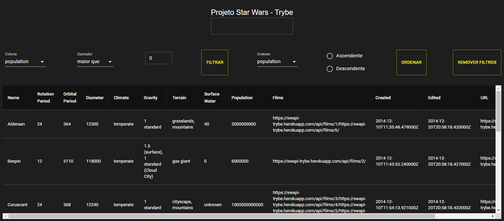

# Boas-vindas ao repositório do projeto Star Wars Planets Search!
  

  
Preview

  

   <h3>Tabela preenchida com os dados retornados da api<h3/>
  
     <h3>Filtro de texto para a tabela</h3>
  
     <h3>Filtro para valores numéricos</h3>
  
     <h3>Múltiplos filtros numéricos</h3>
  
     <h3>Sem filtros repetidos</h3>
  
     <h3>Remover filtros</h3>
  
     <h3>Ordenação das colunas de forma ascendente ou descendente</h3>
  
  

## Contexto
O foco principal deste projeto é, com base nos ensinamentos React da Trybe, fazer filtros em uma lista de planetas do universo Star Wars usando Context API e Hooks para controlar os estados globais.

  
O que é a Trybe?🤔

  A Trybe é uma escola de desenvolvimento web genuinamente comprometida com o sucesso profissional de seus estudantes. Com o Modelo de Sucesso Compartilhado (MSC) oferecido pela Trybe Fintech, uma instituição financeira autorizada pelo Banco Central do Brasil, os alunos têm a opção de pagar apenas quando estiverem trabalhando.

---

Habilidades demonstradas:

- Uso do Context API do React para gerenciar estado.
- Uso do React Hook useState.
- Uso do React Hook useContext.
- Uso do React Hook useEffect.
- Criação de React Hooks customizados.
---

## Técnologias usadas

- [React](https://reactjs.org/)
- [JavaScript](https://developer.mozilla.org/pt-BR/docs/Web/JavaScript)
- [Context API](https://reactjs.org/docs/context.html)
- [React Testing Library](https://testing-library.com/docs/react-testing-library/intro/)

## Entre em contato:

